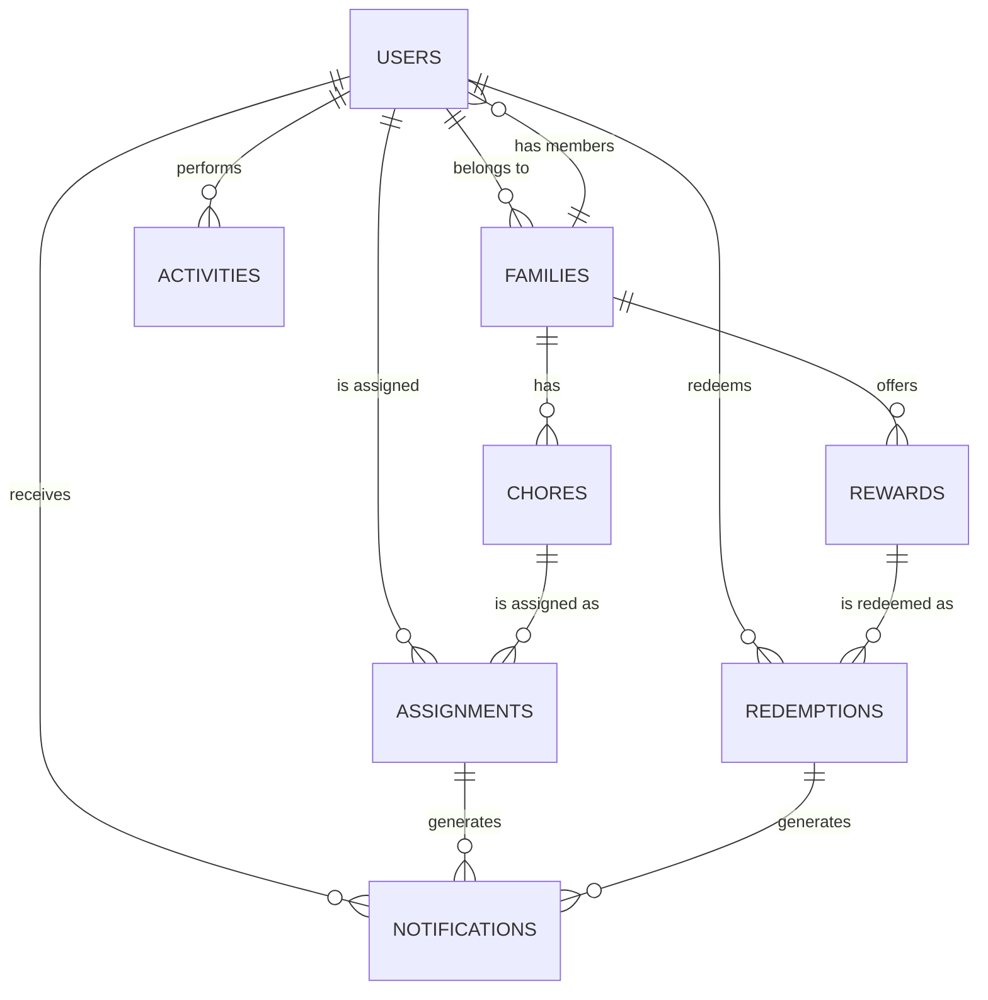

# Database Schema

## 1. Overview

The Family Chores Application uses MongoDB as its primary database, leveraging its document-oriented structure for flexibility and scalability. This document outlines the collections, their schemas, and relationships between them.

## 2. Collections and Schemas

### 2.1 Users Collection

Stores information about all users of the system, including parents and children.

```javascript
{
  _id: ObjectId,
  email: String,                // Email address (if registered with email)
  passwordHash: String,         // Hashed password (if registered with email)
  socialAuth: {                 // Social authentication details
    provider: String,           // "facebook", "linkedin", "github"
    providerId: String,         // ID from the provider
    accessToken: String,        // Encrypted access token
    refreshToken: String,       // Encrypted refresh token
    expiry: Date                // Token expiry date
  },
  profile: {
    firstName: String,
    lastName: String,
    displayName: String,
    avatar: String,             // URL to avatar image
    dateOfBirth: Date,
    bio: String
  },
  role: String,                 // "admin", "parent", "child"
  familyId: ObjectId,           // Reference to family
  preferences: {
    theme: String,              // "light", "dark", "system"
    notifications: {
      email: Boolean,
      push: Boolean,
      inApp: Boolean
    },
    dashboardLayout: Object     // User's custom dashboard layout
  },
  deviceTokens: [String],       // For push notifications
  stats: {
    totalChoresCompleted: Number,
    totalPointsEarned: Number,
    streakDays: Number,
    lastActive: Date
  },
  status: String,               // "active", "inactive", "suspended"
  createdAt: Date,
  updatedAt: Date,
  lastLogin: Date
}
```

### 2.2 Families Collection

Stores information about family units, which group users together.

```javascript
{
  _id: ObjectId,
  name: String,                 // Family name
  createdBy: ObjectId,          // Reference to user who created the family
  members: [                    // Array of family members
    {
      userId: ObjectId,         // Reference to user
      role: String,             // "admin", "parent", "child"
      joinedAt: Date
    }
  ],
  settings: {
    approvalRequired: Boolean,  // Whether chore completion requires approval
    pointSystem: {
      enabled: Boolean,
      multipliers: {
        difficulty: Object,     // Points multiplier based on difficulty
        priority: Object        // Points multiplier based on priority
      }
    },
    choreCategories: [String],  // Custom chore categories
    rewardCategories: [String]  // Custom reward categories
  },
  subscription: {
    plan: String,               // "free", "premium" (for future use)
    expiresAt: Date
  },
  createdAt: Date,
  updatedAt: Date
}
```

### 2.3 Chores Collection

Stores information about chores that can be assigned to family members.

```javascript
{
  _id: ObjectId,
  familyId: ObjectId,           // Reference to family
  title: String,                // Chore title
  description: String,          // Detailed description
  category: String,             // Chore category
  difficulty: String,           // "easy", "medium", "hard"
  estimatedDuration: Number,    // In minutes
  pointValue: Number,           // Base points for completion
  priority: String,             // "low", "medium", "high"
  location: String,             // Where the chore should be performed
  instructions: [String],       // Step-by-step instructions
  resources: [                  // Additional resources
    {
      type: String,             // "link", "image", "video"
      url: String,
      description: String
    }
  ],
  createdBy: ObjectId,          // Reference to user who created the chore
  status: String,               // "active", "inactive", "archived"
  createdAt: Date,
  updatedAt: Date
}
```

### 2.4 Assignments Collection

Stores information about chore assignments to specific users.

```javascript
{
  _id: ObjectId,
  choreId: ObjectId,            // Reference to chore
  familyId: ObjectId,           // Reference to family
  assignedTo: ObjectId,         // Reference to user
  assignedBy: ObjectId,         // Reference to user who assigned the chore
  status: String,               // "pending", "in-progress", "completed", "verified", "overdue", "cancelled"
  schedule: {
    type: String,               // "one-time", "recurring"
    dueDate: Date,              // For one-time chores
    recurring: {
      frequency: String,        // "daily", "weekly", "monthly"
      days: [Number],           // Days of week (0-6, where 0 is Sunday)
      monthDay: Number,         // Day of month (1-31)
      endDate: Date             // Optional end date for recurring chores
    }
  },
  completion: {
    completedAt: Date,
    verifiedAt: Date,
    verifiedBy: ObjectId,       // Reference to user who verified
    evidence: [                 // Optional evidence of completion
      {
        type: String,           // "image", "note"
        content: String,        // URL or text content
        uploadedAt: Date
      }
    ],
    feedback: String,
    rating: Number              // Quality rating (1-5)
  },
  pointsAwarded: Number,        // Actual points awarded (may include bonuses)
  notifications: [              // Record of notifications sent
    {
      type: String,             // "reminder", "overdue", "completion"
      sentAt: Date,
      channel: String           // "email", "push", "in-app"
    }
  ],
  history: [                    // Status change history
    {
      status: String,
      timestamp: Date,
      updatedBy: ObjectId       // Reference to user
    }
  ],
  createdAt: Date,
  updatedAt: Date
}
```

### 2.5 Rewards Collection

Stores information about rewards that can be redeemed with earned points.

```javascript
{
  _id: ObjectId,
  familyId: ObjectId,           // Reference to family
  title: String,                // Reward title
  description: String,          // Detailed description
  category: String,             // Reward category
  pointCost: Number,            // Points required to redeem
  type: String,                 // "material", "privilege", "activity"
  availability: {
    quantity: Number,           // Available quantity (-1 for unlimited)
    startDate: Date,            // When the reward becomes available
    endDate: Date               // When the reward expires
  },
  image: String,                // URL to reward image
  createdBy: ObjectId,          // Reference to user who created the reward
  status: String,               // "active", "inactive", "archived"
  createdAt: Date,
  updatedAt: Date
}
```

### 2.6 Redemptions Collection

Stores information about reward redemptions by users.

```javascript
{
  _id: ObjectId,
  rewardId: ObjectId,           // Reference to reward
  familyId: ObjectId,           // Reference to family
  redeemedBy: ObjectId,         // Reference to user
  approvedBy: ObjectId,         // Reference to user who approved
  pointsSpent: Number,          // Points spent on redemption
  status: String,               // "pending", "approved", "fulfilled", "rejected", "cancelled"
  requestNote: String,          // Note from user requesting the reward
  responseNote: String,         // Note from approver
  history: [                    // Status change history
    {
      status: String,
      timestamp: Date,
      updatedBy: ObjectId       // Reference to user
    }
  ],
  createdAt: Date,
  updatedAt: Date,
  fulfilledAt: Date
}
```

### 2.7 Notifications Collection

Stores information about notifications sent to users.

```javascript
{
  _id: ObjectId,
  userId: ObjectId,             // Reference to user
  familyId: ObjectId,           // Reference to family
  type: String,                 // "chore_assigned", "chore_reminder", "chore_completed", "reward_redeemed", etc.
  title: String,                // Notification title
  message: String,              // Notification message
  relatedTo: {                  // Related entity
    type: String,               // "chore", "assignment", "reward", "redemption"
    id: ObjectId                // Reference to related entity
  },
  channels: [String],           // "email", "push", "in-app"
  status: {
    read: Boolean,              // Whether notification has been read
    readAt: Date,
    delivered: {                // Delivery status by channel
      email: Boolean,
      push: Boolean,
      inApp: Boolean
    }
  },
  createdAt: Date,
  expiresAt: Date               // When the notification should expire
}
```

### 2.8 Activities Collection

Stores information about user activities for audit and analytics purposes.

```javascript
{
  _id: ObjectId,
  userId: ObjectId,             // Reference to user
  familyId: ObjectId,           // Reference to family
  type: String,                 // "login", "logout", "chore_created", "chore_assigned", etc.
  details: Object,              // Activity-specific details
  ipAddress: String,            // User's IP address
  userAgent: String,            // User's browser/device info
  createdAt: Date
}
```

## 3. Relationships



## 4. Indexes

### 4.1 Users Collection
- `email`: Unique index for email-based lookups
- `socialAuth.provider`, `socialAuth.providerId`: Compound index for social auth lookups
- `familyId`: Index for family-based queries
- `role`: Index for role-based queries

### 4.2 Families Collection
- `members.userId`: Index for member-based lookups
- `createdBy`: Index for creator-based lookups

### 4.3 Chores Collection
- `familyId`: Index for family-based queries
- `category`: Index for category-based queries
- `status`: Index for status-based queries

### 4.4 Assignments Collection
- `choreId`: Index for chore-based lookups
- `assignedTo`: Index for assignee-based lookups
- `familyId`: Index for family-based queries
- `status`: Index for status-based queries
- `schedule.dueDate`: Index for due date-based queries

### 4.5 Rewards Collection
- `familyId`: Index for family-based queries
- `category`: Index for category-based queries
- `status`: Index for status-based queries

### 4.6 Redemptions Collection
- `rewardId`: Index for reward-based lookups
- `redeemedBy`: Index for redeemer-based lookups
- `familyId`: Index for family-based queries
- `status`: Index for status-based queries

### 4.7 Notifications Collection
- `userId`: Index for user-based lookups
- `familyId`: Index for family-based queries
- `status.read`: Index for read status-based queries
- `createdAt`: Index for time-based queries

### 4.8 Activities Collection
- `userId`: Index for user-based lookups
- `familyId`: Index for family-based queries
- `type`: Index for type-based queries
- `createdAt`: Index for time-based queries

## 5. Data Migration and Versioning

The database schema will be versioned to support future changes. Migration scripts will be developed for each schema change to ensure data integrity during upgrades.

## 6. Backup and Recovery

Regular automated backups will be configured with the following strategy:
- Daily full backups
- Hourly incremental backups
- 30-day retention period
- Point-in-time recovery capability

## 7. Data Validation

MongoDB schema validation will be implemented to ensure data integrity at the database level. Additional validation will be performed at the application level before data is persisted.

## 8. Data Access Patterns

### 8.1 Common Queries
- Get all chores assigned to a user
- Get all pending chores for a family
- Get all available rewards for a user
- Get unread notifications for a user
- Get activity history for a user or family

### 8.2 Aggregation Pipelines
- Calculate total points earned by a user over time
- Generate chore completion statistics for a family
- Analyze reward redemption patterns