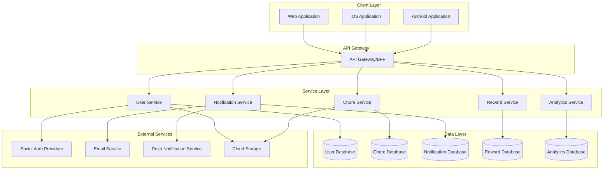
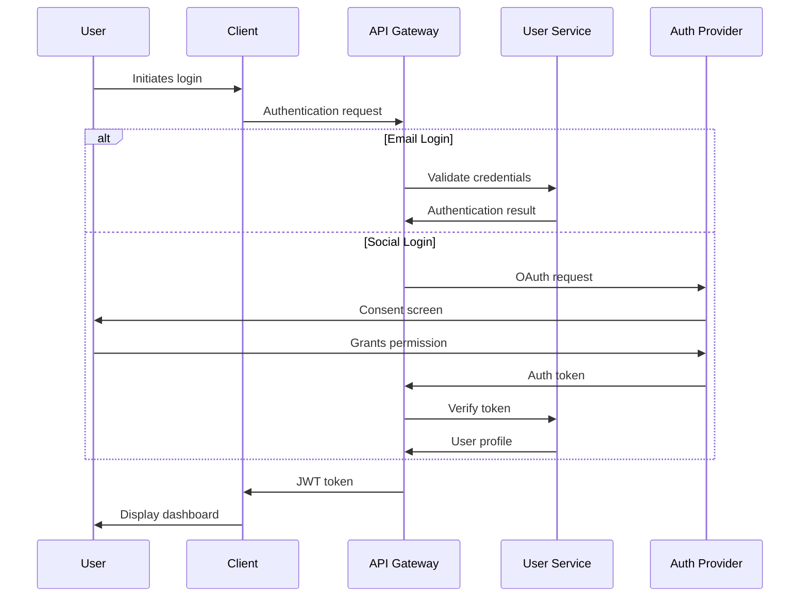
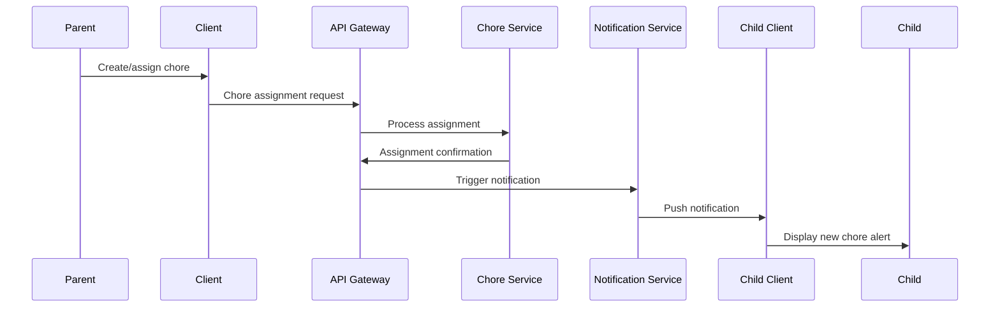
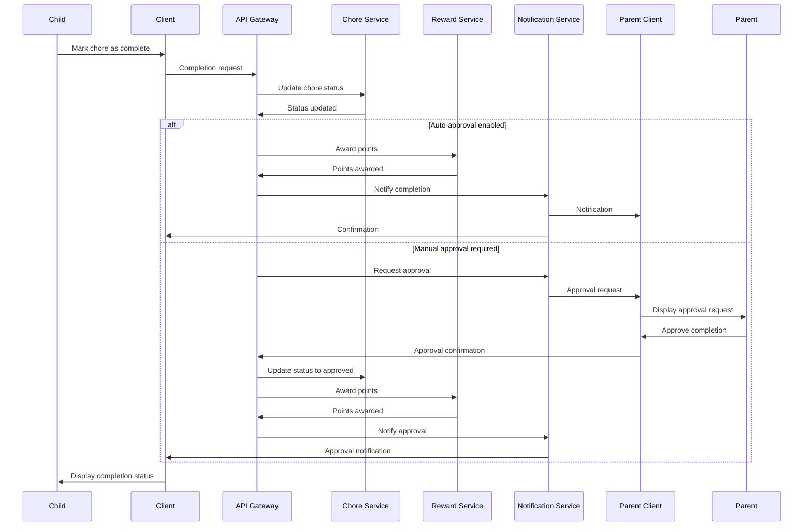
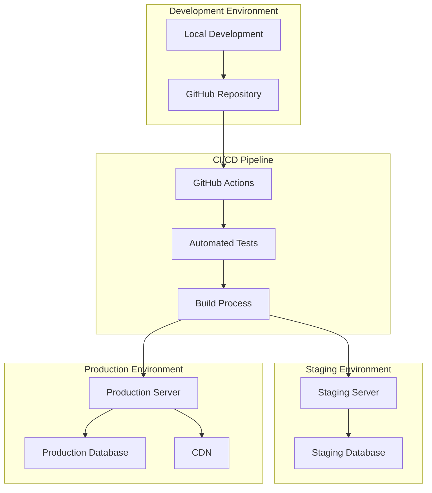

# System Architecture

## 1. Architecture Overview

The Family Chores Application follows a modern, cloud-based architecture designed for scalability, maintainability, and cross-platform compatibility. The system is structured as a multi-tier application with clear separation of concerns between frontend, backend, and data storage layers.

## 2. High-Level Architecture

## 3. Component Description

### 3.1 Client Layer

#### 3.1.1 Web Application
- **Technology**: React.js, Redux, Material-UI
- **Responsibility**: Provides the primary user interface for desktop and mobile web browsers
- **Features**: Responsive design, offline capabilities using Service Workers, PWA support

#### 3.1.2 iOS Application
- **Technology**: Swift, SwiftUI
- **Responsibility**: Native iOS application for Apple devices
- **Features**: Push notifications, offline mode, device-specific optimizations

#### 3.1.3 Android Application
- **Technology**: Kotlin, Jetpack Compose
- **Responsibility**: Native Android application
- **Features**: Push notifications, offline mode, device-specific optimizations

### 3.2 API Gateway

#### 3.2.1 Backend for Frontend (BFF)
- **Technology**: Node.js, Express
- **Responsibility**: Serves as the entry point for all client requests, handles authentication, request routing
- **Features**: Rate limiting, request validation, response caching

### 3.3 Service Layer

#### 3.3.1 User Service
- **Technology**: Node.js, Express
- **Responsibility**: Manages user accounts, authentication, profiles
- **Features**: Social login integration, role management, user preferences

#### 3.3.2 Chore Service
- **Technology**: Node.js, Express
- **Responsibility**: Manages chore definitions, assignments, completion tracking
- **Features**: Recurring chore scheduling, dependency management, approval workflows

#### 3.3.3 Notification Service
- **Technology**: Node.js, Express
- **Responsibility**: Manages alerts, reminders, and notifications
- **Features**: Multi-channel delivery, scheduling, templating

#### 3.3.4 Reward Service
- **Technology**: Node.js, Express
- **Responsibility**: Manages reward definitions, point system, redemption
- **Features**: Point calculation, reward availability, redemption tracking

#### 3.3.5 Analytics Service
- **Technology**: Node.js, Express
- **Responsibility**: Collects and processes usage data, generates reports
- **Features**: Data aggregation, trend analysis, dashboard metrics

### 3.4 Data Layer

#### 3.4.1 Databases
- **Technology**: MongoDB (NoSQL)
- **Responsibility**: Persistent storage for application data
- **Features**: Document-based storage, horizontal scaling, flexible schema

#### 3.4.2 Caching
- **Technology**: Redis
- **Responsibility**: Temporary storage for frequently accessed data
- **Features**: In-memory caching, pub/sub for real-time updates

### 3.5 External Services

#### 3.5.1 Social Auth Providers
- **Technology**: OAuth 2.0 integration with Facebook, LinkedIn, GitHub
- **Responsibility**: Provides authentication services
- **Features**: Token-based authentication, profile data access

#### 3.5.2 Email Service
- **Technology**: SendGrid
- **Responsibility**: Handles email delivery for notifications and verification
- **Features**: Templated emails, delivery tracking

#### 3.5.3 Push Notification Service
- **Technology**: Firebase Cloud Messaging
- **Responsibility**: Delivers push notifications to mobile devices
- **Features**: Cross-platform support, topic-based messaging

#### 3.5.4 Cloud Storage
- **Technology**: AWS S3 or equivalent free tier
- **Responsibility**: Stores user uploads, application assets
- **Features**: Secure storage, CDN integration

## 4. Data Flow

### 4.1 Authentication Flow

### 4.2 Chore Assignment Flow

### 4.3 Chore Completion Flow

## 5. Technology Stack

### 5.1 Frontend Technologies

| Component | Technology | Purpose |
|-----------|------------|---------|
| Web Framework | React.js | Component-based UI development |
| State Management | Redux | Centralized state management |
| UI Library | Material-UI | Pre-built, customizable components |
| API Communication | Axios | HTTP client for API requests |
| Build Tools | Webpack, Babel | Code bundling and transpilation |
| Testing | Jest, React Testing Library | Unit and integration testing |
| iOS Development | Swift, SwiftUI | Native iOS application |
| Android Development | Kotlin, Jetpack Compose | Native Android application |

### 5.2 Backend Technologies

| Component | Technology | Purpose |
|-----------|------------|---------|
| API Framework | Node.js, Express | RESTful API development |
| Authentication | JWT, Passport.js | Secure authentication |
| Validation | Joi | Request validation |
| Database ORM | Mongoose | MongoDB object modeling |
| Caching | Redis | Performance optimization |
| Task Scheduling | node-cron | Recurring chore management |
| API Documentation | Swagger/OpenAPI | API documentation |
| Testing | Mocha, Chai | Unit and integration testing |

### 5.3 DevOps and Infrastructure

| Component | Technology | Purpose |
|-----------|------------|---------|
| CI/CD | GitHub Actions | Automated testing and deployment |
| Containerization | Docker | Consistent environments |
| Cloud Hosting | Heroku (free tier) | Application hosting |
| Database Hosting | MongoDB Atlas (free tier) | Database hosting |
| Monitoring | Sentry (free tier) | Error tracking |
| Analytics | Google Analytics (free tier) | Usage analytics |

## 6. Security Architecture

### 6.1 Authentication and Authorization

- JWT-based authentication with appropriate expiration
- Role-based access control (RBAC)
- OAuth 2.0 integration for social logins
- Secure password storage with bcrypt

### 6.2 Data Protection

- HTTPS/TLS for all communications
- Data encryption at rest
- Input validation and sanitization
- Protection against common web vulnerabilities (XSS, CSRF, SQL Injection)

### 6.3 API Security

- Rate limiting
- Request validation
- CORS configuration
- API key management for external services

## 7. Scalability Considerations

### 7.1 Horizontal Scaling

- Stateless services for easy replication
- Load balancing for distributed traffic
- Database sharding for data distribution

### 7.2 Caching Strategy

- Redis for application-level caching
- Browser caching for static assets
- CDN integration for global content delivery

### 7.3 Performance Optimization

- Lazy loading of non-critical components
- Database query optimization
- Asynchronous processing for non-critical operations

## 8. Deployment Architecture

## 9. Integration Points

### 9.1 External Service Integration

- Social media authentication providers
- Email service providers
- Push notification services
- Cloud storage services

### 9.2 Third-Party API Integration

- Calendar integration for chore scheduling
- Smart home device integration (future phase)
- Messaging platforms for notifications

## 10. Future Architecture Considerations

### 10.1 Microservices Evolution

- Further decomposition of services as the application scales
- Service mesh implementation for complex service communication
- Event-driven architecture for improved decoupling

### 10.2 Advanced Features

- Machine learning for chore recommendations
- Voice interface integration
- IoT device integration for automated chore verification