# Workflow Diagrams

This document contains workflow diagrams for key processes in the Family Chores Application, created using Mermaid.js syntax.

Please ensure that Mermaid.js is properly rendered in your Markdown viewer to visualize the diagrams correctly.

## 1. User Registration and Onboarding

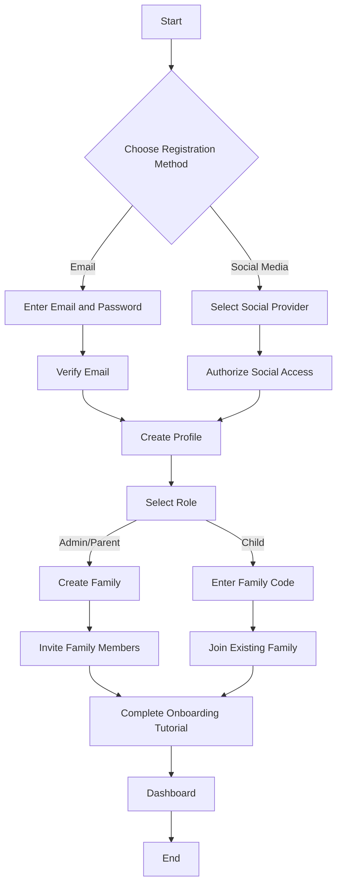

## 2. Chore Creation and Assignment

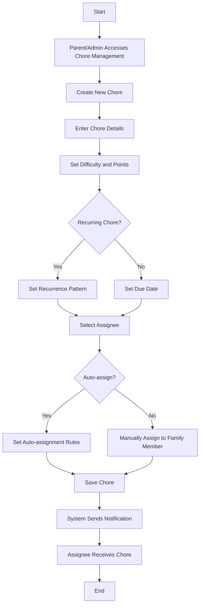

## 3. Chore Completion and Verification

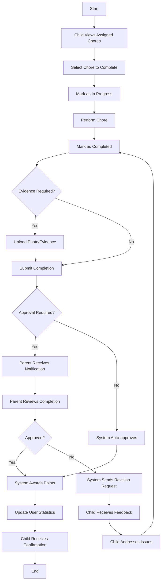

## 4. Reward Redemption Process

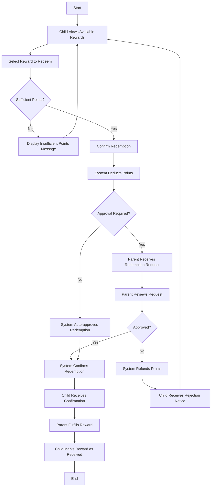

## 5. Notification and Reminder Flow

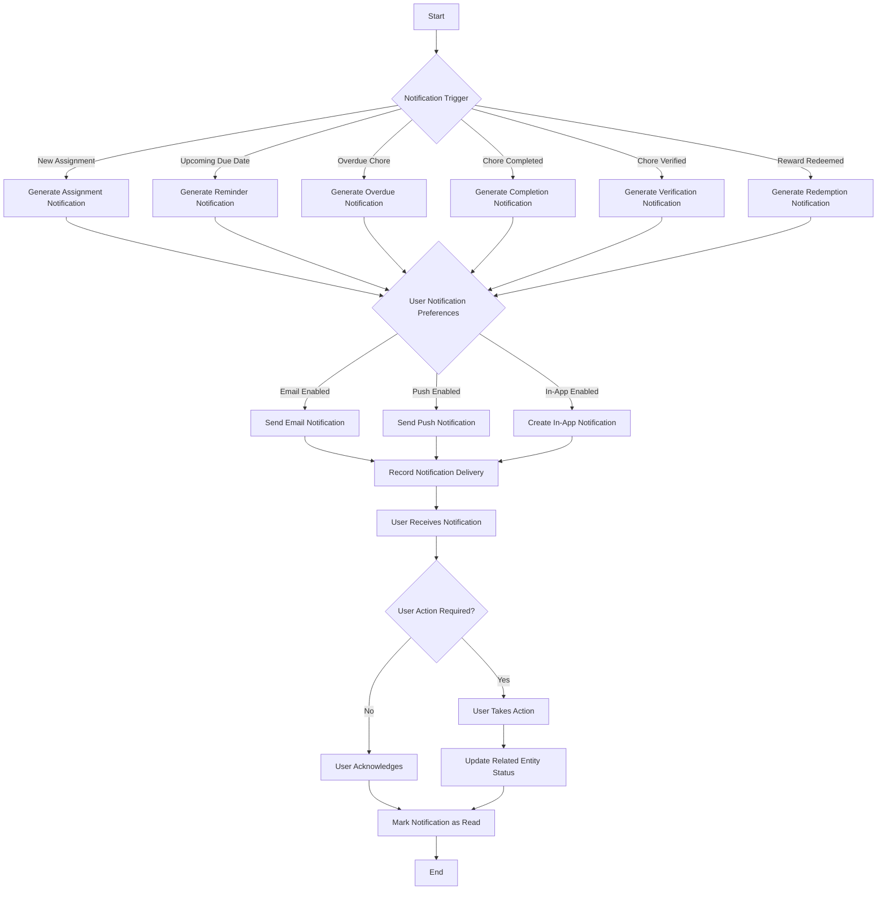

## 6. Family Management Process

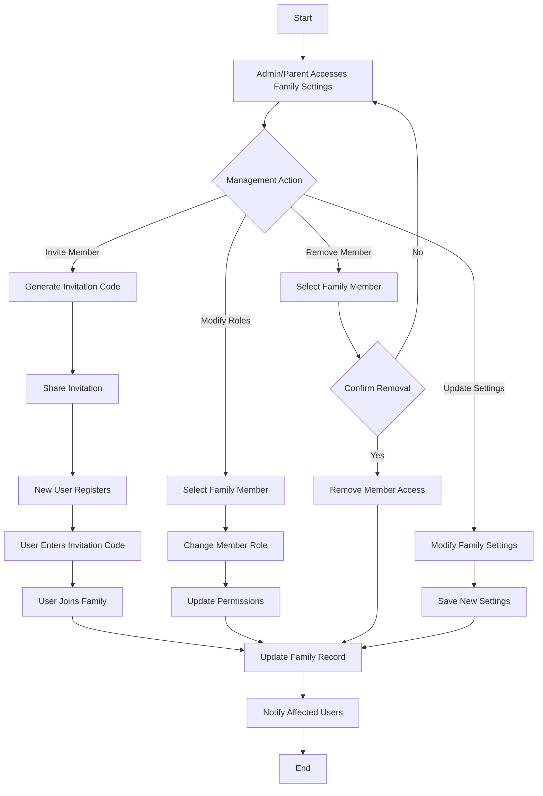

## 7. Dashboard and Reporting Flow

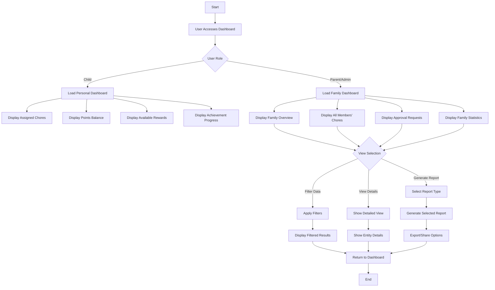

## 8. Reward System Flow

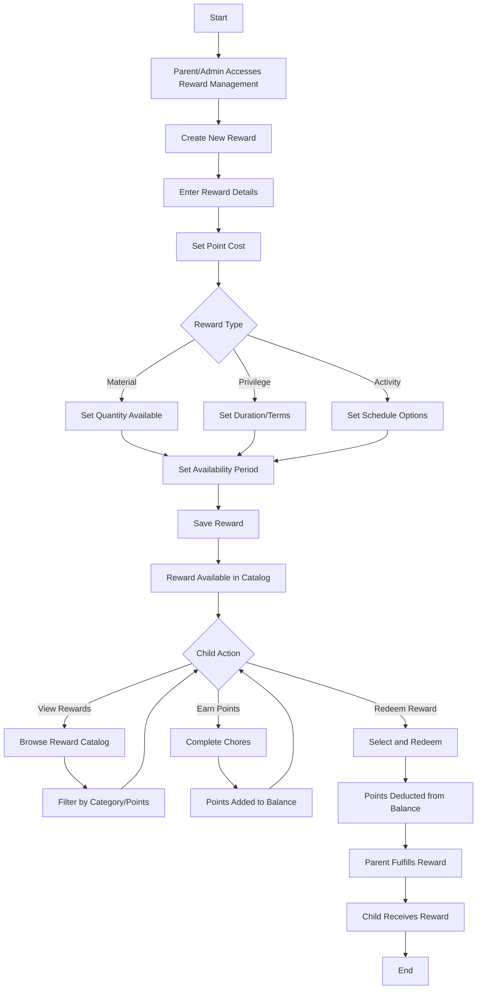

## 9. Mobile App Synchronization Flow

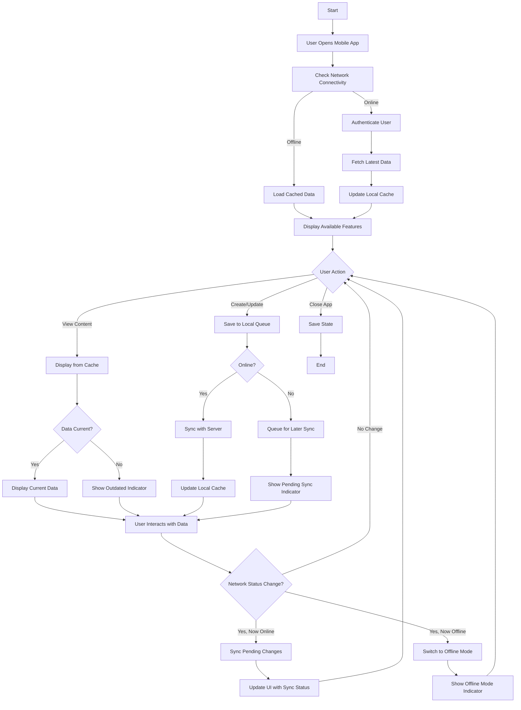

## 10. User Authentication Flow

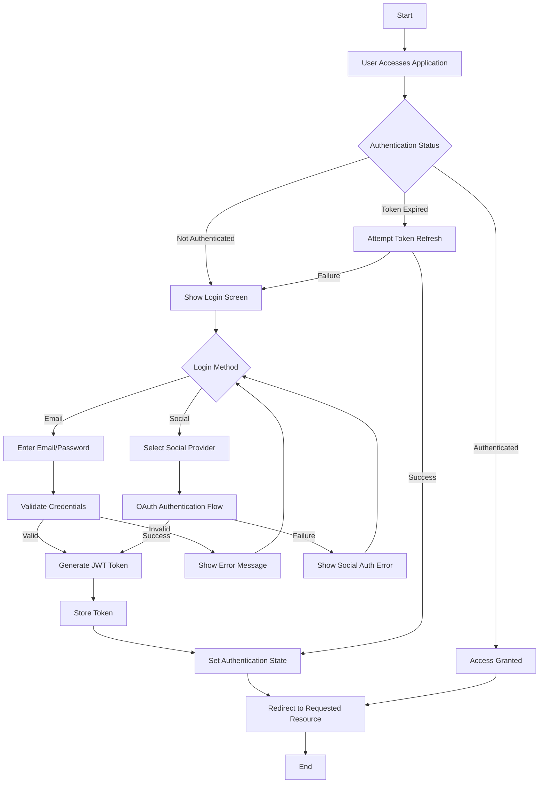

## 11. PI Planning and Development Workflow

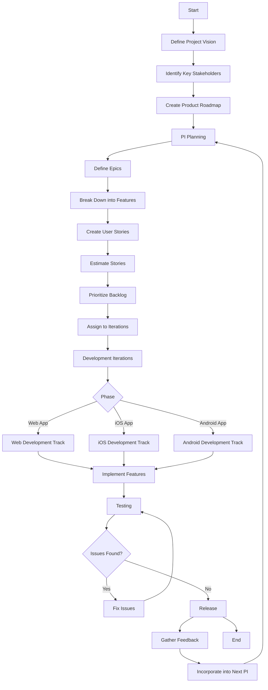

## 12. Deployment Pipeline

```mermaid
flowchart TD
    A[Start] --> B[Developer Commits Code]
    B --> C[Automated Tests Run]
    
    C -->|Tests Pass| D[Build Application]
    C -->|Tests Fail| E[Developer Fixes Issues]
    
    E --> B
    
    D --> F[Deploy to Dev Environment]
    F --> G[QA Testing]
    
    G -->|Issues Found| H[Developer Fixes Issues]
    G -->|No Issues| I[Deploy to Staging]
    
    H --> B
    
    I --> J[Integration Testing]
    J -->|Issues Found| K[Developer Fixes Issues]
    J -->|No Issues| L[User Acceptance Testing]
    
    K --> B
    
    L -->|Approved| M[Deploy to Production]
    L -->|Rejected| N[Product Owner Reviews]
    
    N --> O[Revise Requirements]
    O --> P[Developer Implements Changes]
    P --> B
    
    M --> Q[Monitor Application]
    Q --> R[Gather Metrics]
    R --> S[Identify Improvements]
    S --> T[Add to Backlog]
    T --> U[End]